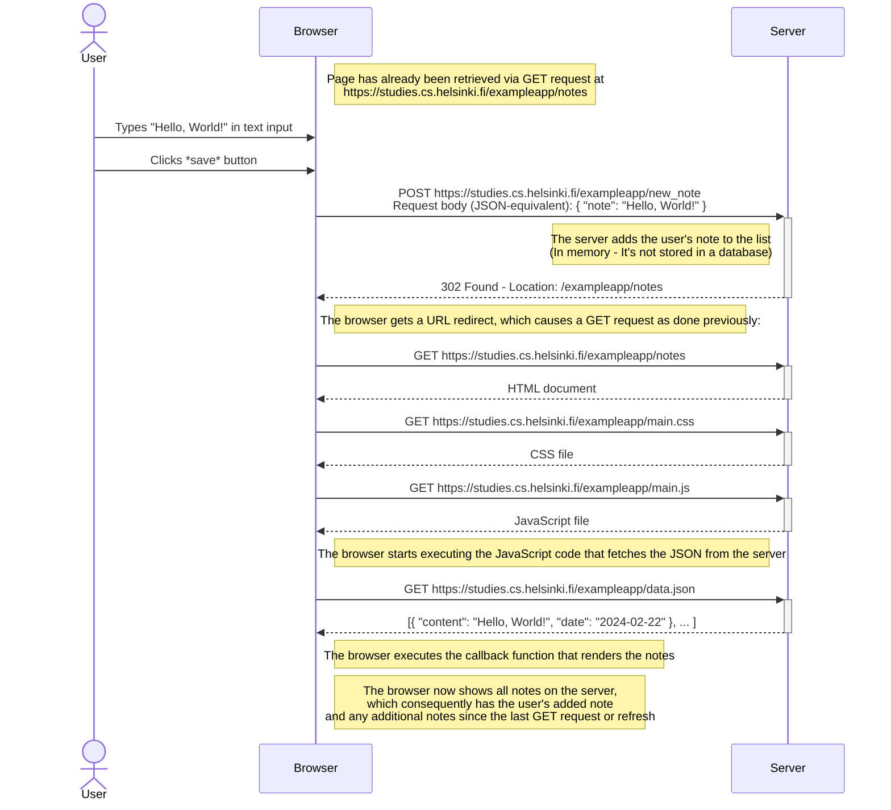

# Part 0 - Exercises 0.4-0.6

After reading the articles from exercises 0.1-0.3, here are the
requested diagrams for exercises 0.4-0.6.

## Exercise 0.4 - New Note in Traditional Web App

This diagram depicts what happens when a user writes content in the
text field and clicks the `save` button on the page
[https://studies.cs.helsinki.fi/exampleapp/notes](https://studies.cs.helsinki.fi/exampleapp/notes)

