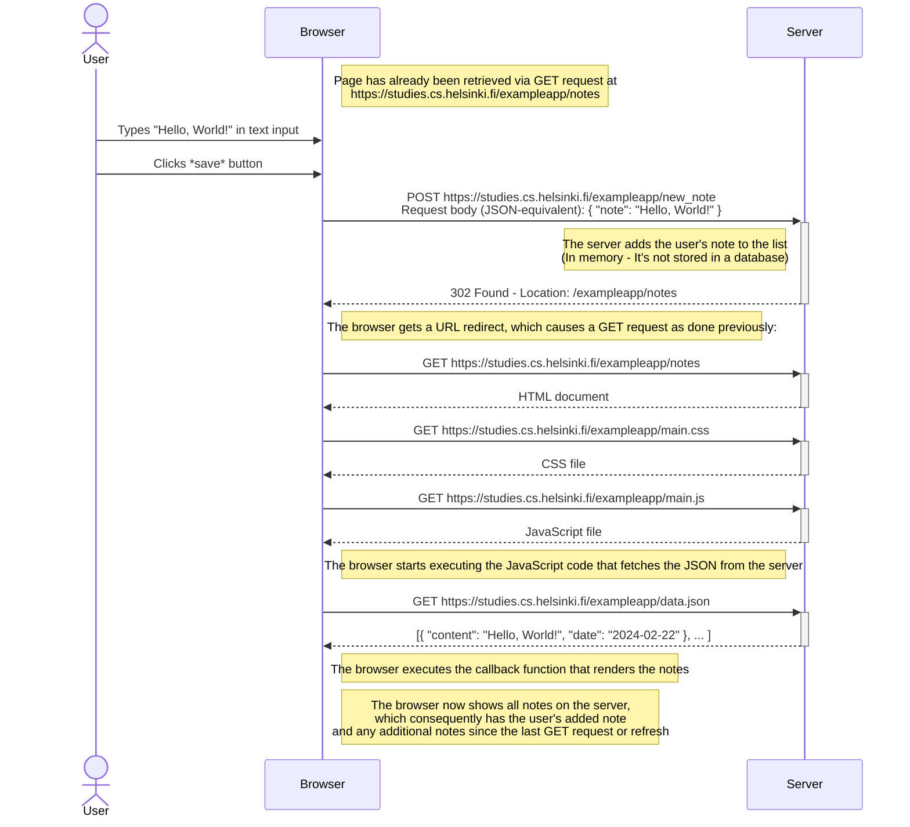
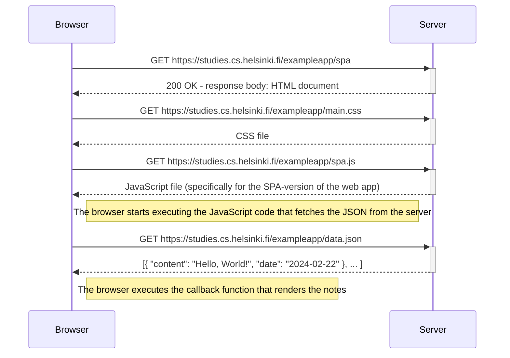
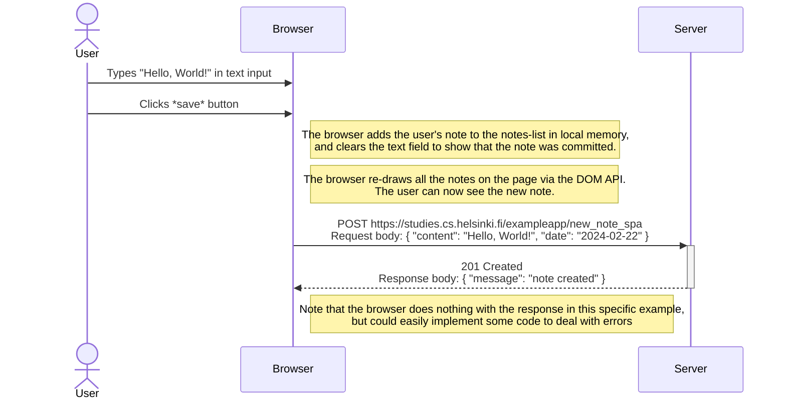

# Part 0 - Exercises 0.4-0.6

After reading the articles from exercises 0.1-0.3, here are the
requested diagrams for exercises 0.4-0.6.

## Exercise 0.4 - New Note in Traditional Web App

This diagram depicts what happens when a user writes content in the
text field and clicks the `save` button on the page
[https://studies.cs.helsinki.fi/exampleapp/notes](https://studies.cs.helsinki.fi/exampleapp/notes)

## Exercise 0.5 - Single-Page App Diagram

This diagram depicts what happens when a user navigates to the
single-page app version of the notes app at
[https://studies.cs.helsinki.fi/exampleapp/spa](https://studies.cs.helsinki.fi/exampleapp/spa)

Note that the initial GET request is the same as with the
traditional-style web app. The real difference between the two web app
approaches will be seen in the next exercise, where the JavaScript
will directly manipulate the DOM rather than refresh the whole page
with a new GET request.

## Exercise 0.6 - New Note in Single-Page App

This diagram depicts what happens when a user writes content in the
text field and clicks the `save` button on the SPA-version of the
notes app found at
[https://studies.cs.helsinki.fi/exampleapp/spa](https://studies.cs.helsinki.fi/exampleapp/spa)

As you can see, the SPA app architecture is more efficient on
bandwidth than the traditional app architecture. Instead of
re-requesting all the data for a page, the SPA is simply updating
portions of the page that need to be updated.

An important note to point-out is that this implementation of a
Single-Page App does not follow RESTful API practices. Don't make an
SPA like this. There are better, cleaner, and more accepted ways of
implementing endpoints.
